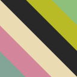

  

<h1 align="center">gruvbox-plain</h1>

Editor theme for VSCode and JetBrains IDEs, based on [morhetz/gruvbox](https://github.com/morhetz/gruvbox) but with a plainer color palette for syntax highlighting. The theme comes with two palettes: `gruvbox-plain-warm` and `gruvbox-plain-cold` (latter only available for VSCode).

## Color Scheme

gruvbox-plain uses a limited subset of the gruvbox dark mode color palette for syntax highlighting. The table below shows the general usage of the different colors.

|                                        Usage |                         `gruvbox-plain-warm`                          |                         `gruvbox-plain-cold`                          |
| -------------------------------------------: | :-------------------------------------------------------------------: | :-------------------------------------------------------------------: |
|            Variables, properties, plain text | `#ebdbb2`  | `#ebdbb2`  |
|                          Keywords, operators | `#fe8019`  | `#d3869b`  |
| Types, classes, namespaces, components, tags | `#fe8019`  | `#83a598`  |
|                           Functions, methods | `#b8bb26`  | `#b8bb26`  |
|                   Values, language constants | `#8ec07c`  | `#8ec07c`  |
|                                  Punctuation | `#a89984`  | `#a89984`  |
|                      Comments, documentation | `#928374`  | `#928374`  |
|                             Background color | `#282828`  | `#282828`  |

For edge cases in languages where these may not apply, the color deemed most appropriate has been chosen. This can always be overridden under `editor.tokenColorCustomizations` in VSCode's `settings.json`, or `Preferences -> Editor -> Color Scheme` in JetBrains IDEs.

## Credits

- [morhetz/gruvbox](https://github.com/morhetz/gruvbox) for the original color scheme
  - _Copyright (c) 2017 Pavel Pertsev, [MIT/X11 license](https://github.com/morhetz/gruvbox#license)_
- [jdinhify/vscode-theme-gruvbox](https://github.com/jdinhify/vscode-theme-gruvbox) for the base VSCode UI theme
  - _Copyright (c) 2017 JD, [MIT license](https://github.com/jdinhify/vscode-theme-gruvbox/blob/main/LICENSE)_
- [Vincent-P/gruvbox-intellij-theme](https://github.com/Vincent-P/gruvbox-intellij-theme) for the base JetBrains UI theme
  - _Copyright (c) 2019 Vincent Parizet, [MIT license](https://github.com/Vincent-P/gruvbox-intellij-theme/blob/master/LICENSE)_
